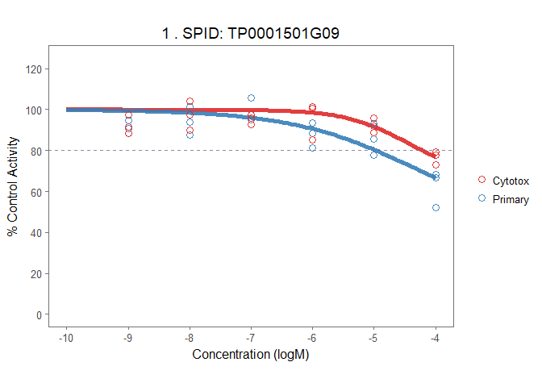
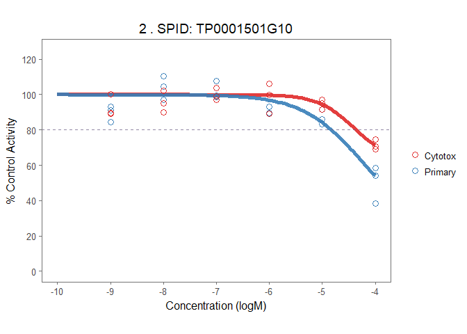

<!-- README.md is generated from README.Rmd. Please edit that file -->
Introduction
============

The `toxplot` (Toxicology Plot) package provides a convenient interface to batch process high-throughput toxicology bioassay screening data. It's designed specifically for screening experiment that features a primary assay and a companion cytotoxicity assay. This package provides functions for data normalization, quality-control analysis, dose-response curve fitting, visualization, and a unqiue toxicity-adjusted potency ranking system.

*This package was initially written to analyze NIS RAIU assay screening of ToxCast phase I chemical library. Refer to the [analysis markdown](https://github.com/njekin/NIS-RAIU-assay-ToxCast-Phase1_v2-screening-analysis) for detailed usage of the package in this study.*

Installation
============

You can install the package in R from github using *devtools*.

``` r
devtools::install_github('njekin/ToxPlot-R-Package')
library(toxplot)
```

Format of input data
====================

To allow the package process data correctly, it is essential to ensure the data input follows required format. Below are the essential columns to include in the input data. Since this package is designed to look at a primary inhibition assay and a parallel cell viability/cytotoxicity assay simultaneously, data from both assays should be put together in a single input file or dataframe.

Columns required:

-   assay: name of the assay.
-   apid: assay plate id. apid shoud be a unique id for each 96 well plate, can distinguish replicate, but doesn't distinguish primary and cytotox assay
-   pid: plate id. used to represent mother plate id, doesn't distinguish replicate, nor assay type.
-   spid: chemical sample name/ID
-   rowi: row position on 96 well plate
-   coli: column position on 96 well plate
-   rval: raw reading value for each well
-   repi: replicate id, (1 to 3)
-   conc: molar concentration (M, no the uM that ToxCast pipeline uses)
-   wllt: well type. define whether a well contains a control or a test sample

> Welltype explained:
> t: test chemical/sample
> n: DMSO negative control pr: positive control of primary assay, for RAIU assay the chemical is NaClO4
> nrc: negative chemical control (2,4-D, a chemical that is supposed to be negative in both raiu and celltiter-glo toxicity assay) pc: positive control for celltiter-glo cytotixicity assay (DCNQ)

Demo data included in the package
=================================

Load the demo dataset included in the package. Below is the head of the dataframe.

``` r
library(devtools)
library(tidyverse)
load_all()

knitr::kable(head(demo_mc), caption = "Head rows of demo data")
```

| assay   | pid       | spid |  rowi|  coli|  conc| wllt |  wllq| rep  |   rval| apid            |
|:--------|:----------|:-----|-----:|-----:|-----:|:-----|-----:|:-----|------:|:----------------|
| Cytotox | Plate\_11 | DMSO |     1|     1|    NA| n    |     1| rep1 |  51931| Plate\_11\_rep1 |
| Cytotox | Plate\_11 | DMSO |     2|    12|    NA| n    |     1| rep1 |  48694| Plate\_11\_rep1 |
| Cytotox | Plate\_11 | DMSO |     3|    12|    NA| n    |     1| rep1 |  47870| Plate\_11\_rep1 |
| Cytotox | Plate\_11 | DMSO |     4|    12|    NA| n    |     1| rep1 |  47624| Plate\_11\_rep1 |
| Cytotox | Plate\_11 | DMSO |     5|    12|    NA| n    |     1| rep1 |  47383| Plate\_11\_rep1 |
| Cytotox | Plate\_11 | DMSO |     6|    12|    NA| n    |     1| rep1 |  46533| Plate\_11\_rep1 |

Data Analysis
=============

Define basic assay info
-----------------------

Before analyzing the data, it is necessary to define the name of the primary and cytotoxicity assay.
*Note that the names defined here should exactly match what's provided in the <assay> column of the input dataframe.*

``` r
  #define the names of the primary and toxicity assay.
assay_info <- list(
  prim_assay = "Primary",
  toxi_assay = "Cytotox"
)
```

Data Normalization
------------------

The `normalize_per_plate` function normalize raw readings as percent of the median/mean of negative control wells (DMSO in this case). The normalized values are included in `nval_mean` and `nval_median` column.

``` r
# normalization
demo_mc_norm <- normalize_per_plate(demo_mc, nctrl = "DMSO")
knitr::kable(head(demo_mc_norm))
```

| assay   | pid       | spid |  rowi|  coli|  conc| wllt |  wllq| rep  |   rval| apid            |  nval\_mean|  nval\_median|
|:--------|:----------|:-----|-----:|-----:|-----:|:-----|-----:|:-----|------:|:----------------|-----------:|-------------:|
| Cytotox | Plate\_11 | DMSO |     1|     1|    NA| n    |     1| rep1 |  51931| Plate\_11\_rep1 |   107.66974|     108.76285|
| Cytotox | Plate\_11 | DMSO |     2|    12|    NA| n    |     1| rep1 |  48694| Plate\_11\_rep1 |   100.95839|     101.98337|
| Cytotox | Plate\_11 | DMSO |     3|    12|    NA| n    |     1| rep1 |  47870| Plate\_11\_rep1 |    99.24998|     100.25761|
| Cytotox | Plate\_11 | DMSO |     4|    12|    NA| n    |     1| rep1 |  47624| Plate\_11\_rep1 |    98.73994|      99.74239|
| Cytotox | Plate\_11 | DMSO |     5|    12|    NA| n    |     1| rep1 |  47383| Plate\_11\_rep1 |    98.24027|      99.23765|
| Cytotox | Plate\_11 | DMSO |     6|    12|    NA| n    |     1| rep1 |  46533| Plate\_11\_rep1 |    96.47794|      97.45743|

Quality Control Metrics
-----------------------

The `qc_per_plate` function calculate qc metrics for each assay plate, returns three tables each representing the statistics of negative controls, positive controls and QC measures including the CV of DMSO controls and Z' score.

Z' factor is calculated as follows:
$$Z'=1-\\frac{3\\sigma\_{positive\\ control} + 3\\sigma\_{DMSO\\ control}}{|\\mu\_{positive\\ control} - \\mu\_{DMSO\\ control}|}$$

``` r
# qc
qc <- qc_per_plate(demo_mc_norm, assay_info)
knitr::kable(qc$neg_ctrl_sum)
```

| apid            | assay   |  count\_DMSO|  count\_DMSO\_NA|  mean\_DMSO|  sd\_DMSO|  CV\_DMSO|
|:----------------|:--------|------------:|----------------:|-----------:|---------:|---------:|
| Plate\_11\_rep1 | Cytotox |            8|                0|   101.01525|  4.234387|  4.191830|
| Plate\_11\_rep1 | Primary |            8|                0|    98.27582|  7.857461|  7.995315|
| Plate\_11\_rep2 | Cytotox |            8|                0|   101.42554|  5.750167|  5.669348|
| Plate\_11\_rep2 | Primary |            8|                0|   102.37073|  9.500463|  9.280449|
| Plate\_11\_rep3 | Cytotox |            8|                0|    99.74308|  4.735941|  4.748140|
| Plate\_11\_rep3 | Primary |            8|                0|    96.74751|  8.379446|  8.661149|

``` r
knitr::kable(qc$pos_ctrl_sum)
```

| apid            | assay   |  sd\_positive|  mean\_positive|
|:----------------|:--------|-------------:|---------------:|
| Plate\_11\_rep1 | Primary |     0.1785015|        3.061242|
| Plate\_11\_rep2 | Primary |     0.2166091|        3.571755|
| Plate\_11\_rep3 | Primary |     0.3947476|        3.016518|
| Plate\_11\_rep1 | Cytotox |            NA|        4.102876|
| Plate\_11\_rep2 | Cytotox |            NA|        4.007689|
| Plate\_11\_rep3 | Cytotox |            NA|        4.476789|

``` r
knitr::kable(qc$qc)
```

| unique\_id               | apid            | assay   |  CV\_DMSO|   Z\_prime|      SSMD|
|:-------------------------|:----------------|:--------|---------:|----------:|---------:|
| Plate\_11\_rep1\_Primary | Plate\_11\_rep1 | Primary |  7.995315|  0.7468046|  12.11460|
| Plate\_11\_rep2\_Primary | Plate\_11\_rep2 | Primary |  9.280449|  0.7049441|  10.39668|
| Plate\_11\_rep3\_Primary | Plate\_11\_rep3 | Primary |  8.661149|  0.7191689|  11.17343|
| Plate\_11\_rep1\_Cytotox | Plate\_11\_rep1 | Cytotox |  4.191830|  0.8689211|  22.88699|
| Plate\_11\_rep2\_Cytotox | Plate\_11\_rep2 | Cytotox |  5.669348|  0.8229226|  16.94174|
| Plate\_11\_rep3\_Cytotox | Plate\_11\_rep3 | Cytotox |  4.748140|  0.8508620|  20.11560|

Dose-response curve fitting
---------------------------

The `fit_curve_tcpl` function uses the hill model provided in U.S.EPA's ToxCast pipeline `tcpl` package[1] to fit dose-response curves. This function serves as an convenient interface to call the `tcplFit` function in the `tcpl` package, and returns a list object containing all data and modeling results. Compared to using the `tcpl` package, `toxplot` package doesn't require usage of mysql/sqlite database.

The Hill Model:

$$f(x) = \\frac{tp}{1+10^{(ga-x)gw}}$$

Where x is the log concentration, tp is the top asymptote, ga is the AC50 (the log concentration where the modeled activity equals 50% of the top asymptote), and gw is the hill coefficient. The Hill model provided in the tcpl R package constrains the three parameters as following:

-   1.  0 ≤ tp ≤ 1.2 times the maximum response value
-   1.  (minimum log concentration minus 2) ≤ ga ≤ (maximum log concentration plus 0.5)
-   1.  0.3 ≤ gw ≤ 8

``` r
# curve fitting
demo_md <- fit_curve_tcpl(filter(demo_mc_norm, wllt == "t"), assay_info)
#> Processing 9 samples(spid)....
#> TP0001501G09 ||TP0001501G10 ||TP0001501G11 ||TP0001502A01 ||TP0001502B01 ||TP0001502B03 ||TP0001502B04 ||TP0001502B05 ||TP0001502B07 ||
#> Curve Fitting Completed!
#> Calculation time: 1.7 secs
```

Rank Chemicals
--------------

A toxicity-adjusted ranking score is calculated to rank chemical potency.
For more information about the calculation of ranking score, please refer to this [publication]()

``` r
# calculate ranking score
demo_rank <- rank_tcpl(demo_md)
knitr::kable(head(demo_rank))
```

|  index| spid         | chnm | casn |         taa|  med\_diff|  AC50\_toxi|  AC50\_prim|  absEC80\_toxi|  absEC50\_toxi|  absEC80\_prim|  absEC50\_prim|  cyto\_lim| ranking\_score |
|------:|:-------------|:-----|:-----|-----------:|----------:|-----------:|-----------:|--------------:|--------------:|--------------:|--------------:|----------:|:---------------|
|      1| TP0001501G09 | NA   | NA   |   6.0094767|  11.056046|   -4.457038|   -4.318049|      -4.208958|             NA|      -4.967273|             NA|  -4.208958| NA             |
|      2| TP0001501G10 | NA   | NA   |   8.7902903|  16.530767|   -4.413282|   -4.273303|      -4.359345|             NA|      -4.826529|             NA|  -4.359345| NA             |
|      3| TP0001501G11 | NA   | NA   |  12.5729649|  15.735048|   -4.350704|   -4.462967|      -4.549528|       -4.04231|      -4.901908|      -4.352939|  -4.549528| NA             |
|      4| TP0001502A01 | NA   | NA   |   0.1157745|   2.621527|   -4.384463|   -4.415429|      -4.096896|             NA|      -4.174754|             NA|  -4.096896| NA             |
|      5| TP0001502B01 | NA   | NA   |   4.6352583|   9.095696|   -4.358898|   -4.302734|      -4.361850|             NA|      -4.569708|             NA|  -4.361850| NA             |
|      6| TP0001502B03 | NA   | NA   |  11.3269038|  33.796854|          NA|   -4.582086|             NA|             NA|      -4.923170|             NA|         NA| NA             |

Visualize data and fitted curve
-------------------------------

The `plot_tcpl` function uses `ggplot2` to plot all the fitted curve with data in original direction. The funciton returns a list of ggplot2 objects.

``` r
# make plots
demo_plots <- plot_tcpl(demo_md, demo_rank, notation = FALSE)
# Visualize plot
demo_plots[[1]]
demo_plots[[2]]
```



It is also very convenient to have the interactive version of the plot with the `plotly` package.

``` r
library(plotly)
ggplotly(demo_plots[[2]])
```

Export plots to pdf
-------------------

The `save_plot_pdf` function saves all plots into one pdf file.

``` r
save_plot_pdf(demo_plots, "allplots.pdf")
```

Reference
---------

[1] <https://cran.r-project.org/package=tcpl>
